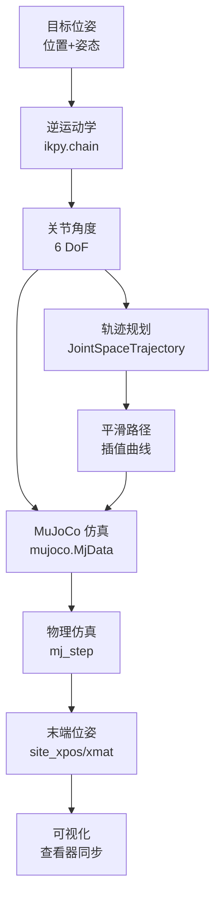

# UR5e 机械臂 MuJoCo 仿真项目

基于 MuJoCo 物理引擎的 UR5e 机械臂运动学分析与仿真平台，专注机器人运动学、轨迹规划和可视化的研究学习。

## 项目概述

本仓库实现了一套完整的 UR5e 机械臂仿真与分析工具链，包括：
- ✅ 逆运动学求解（ikpy）
- ✅ 正向运动学建模（DH参数 & URDF）
- ✅ 关节空间轨迹规划
- ✅ 实时 MuJoCo 仿真
- ✅ 工作空间分析
- ✅ 多格式姿态可视化

## 系统架构

```
┌─────────────────────────────────────────────────┐
│            应用层（Python Scripts）             │
├─────────────────────────────────────────────────┤
│  arm_mujoco.py  │  move.py  │  visualize_dh.py │
│  └─ 逆运动学   │  └─ 轨迹  │  └─ DH参数可视化  │
│     仿真演示   │     规划   │                    │
├─────────────────────────────────────────────────┤
│           workspace_analysis.py                 │
│           └─ 工作空间边界分析                    │
├─────────────────────────────────────────────────┤
│          中间件层（数学计算库）                  │
├─────────────────────────────────────────────────┤
│  ikpy（逆运动学）  │  transforms3d（3D变换） │
│  numpy（数值计算） │  matplotlib（可视化）   │
├─────────────────────────────────────────────────┤
│            物理引擎层（MuJoCo）                 │
│  └─ 实时仿真、碰撞检测、动力学计算             │
├─────────────────────────────────────────────────┤
│              模型层                             │
├─────────────────────────────────────────────────┤
│  MuJoCo XML  │  URDF  │  3D 模型资产          │
└─────────────────────────────────────────────────┘
```

### 数据流



## 快速开始

### 环境要求

- Python 3.7+
- MuJoCo 2.3.0+
- Ubuntu 20.04+ / macOS / Windows

### 安装依赖

```bash
# 核心库
pip install mujoco ikpy transforms3d numpy matplotlib

# 可选（建议安装）
pip install scipy  # ikpy 的增强功能
```

### 运行示例

```bash
# 1. 基础逆运动学仿真
python arm/arm_mujoco.py

# 2. 关节空间轨迹规划演示
python arm/move.py

# 3. DH 参数可视化（生成图表）
python arm/visualize_dh.py

# 4. 工作空间分析
python arm/workspace_analysis.py
```

## 功能模块详解

### 1. 逆运动学仿真（arm_mujoco.py）

**核心功能**
- 加载 MuJoCo 场景模型
- 使用 ikpy 计算逆运动学
- 实时控制机械臂到达目标位姿
- 验证末端执行器精度

**关键参数**
```python
ee_pos = [-0.13, 0.5, 0.1]      # 目标位置 [x, y, z] (米)
ee_euler = [3.14, 0, 1.57]      # 欧拉角 [roll, pitch, yaw] (弧度)
ref_pos = [0, -1.57, -1.34, ...]  # 初始关节角
```

**运行效果**
```
End Effector Site ID: 6
End Effector Position: [-0.13  0.5   0.1 ]
```

### 2. 轨迹规划（move.py）

**核心类：JointSpaceTrajectory**

**功能特性**
- 关节空间轨迹生成（平滑插值）
- 实时末端位姿监测
- 多格式姿态表示
- 空间误差计算

**API 接口**
```python
# 初始化轨迹
trajectory = JointSpaceTrajectory(q_start, q_end, steps=200)

# 获取当前步的目标关节角
q_target = trajectory.get_next_position()

# 实时监测末端位姿
ee_pos, ee_rot, ee_euler, ee_quat = get_ee_pose(model, data)

# 计算轨迹误差
error = np.linalg.norm(ee_pos - target_pos)
```

**姿态表示支持**
- 位置：`[x, y, z]` (米)
- 旋转矩阵：3×3 矩阵
- 欧拉角：`[roll, pitch, yaw]` (弧度)
- 四元数：`[w, x, y, z]`

### 3. DH 参数建模（visualize_dh.py）

**核心类：UR5eDHModel**

**UR5e DH 参数表**
| 关节 | θ (rad) | d (m) | a (m) | α (rad) |
|------|---------|-------|-------|---------|
| 1    | θ₁      | 0.163 | 0     | π/2     |
| 2    | θ₂      | 0     | 0.425 | 0       |
| 3    | θ₃      | 0     | 0.392 | 0       |
| 4    | θ₄      | 0.127 | 0     | π/2     |
| 5    | θ₅      | 0.1   | 0     | -π/2    |
| 6    | θ₆      | 0.1   | 0     | 0       |

**输出内容**
- 6种典型姿态的 3D 可视化
- DH 参数对比表
- 工作空间边界分析
- 正向运动学验证

**生成文件**：`ur5e_dh_visualization.png`

### 4. 工作空间分析（workspace_analysis.py）

**核心类：UR5eKinematics**

**算法特性**
- 蒙特卡洛采样（默认 1000 点）
- 理论上界计算
- 多视角可视化（3D/XY/XZ）

**关键参数**
```python
d1 = 0.163  # 基座高度 (m)
a2 = 0.425  # 大臂长度 (m)
a3 = 0.392  # 小臂长度 (m)
d4 = 0.127  # 腕部1偏移 (m)
d5 = 0.1    # 腕部2偏移 (m)
d6 = 0.1    # 末端偏移 (m)
```

**分析结果**
- 最大水平延伸：0.817 m
- Z 轴范围：-0.654 m ~ 0.98 m
- XY 平面投影：圆形区域
- XZ 平面投影：扇形区域

## 目录结构

```
armlab/
├── arm/                           # 核心算法模块
│   ├── arm_mujoco.py             # MuJoCo 逆运动学演示
│   ├── move.py                   # 轨迹规划与实时控制
│   ├── visualize_dh.py           # DH 参数可视化
│   ├── workspace_analysis.py     # 工作空间分析
│   ├── arm_plot.py               # 基础绘图（参考）
│   └── dh_parameters_guide.md    # DH 参数理论文档
│
├── model/                         # 机器人模型资源
│   ├── universal_robots_ur5e/    # MuJoCo XML 模型
│   │   ├── scene.xml             # 场景配置
│   │   ├── ur5e.xml              # 机械臂本体
│   │   └── assets/               # 3D 模型文件 (.obj)
│   └── urdf/                     # URDF 格式模型
│       ├── ur5e_robot.urdf       # 用于 ikpy 逆运动学
│       └── xacro/                # URDF 源文件
│
├── README.md                      # 项目文档
└── .gitignore
```

## 技术参数

### UR5e 机械臂规格
- **自由度**：6 旋转关节
- **工作半径**：850 mm
- **负载**：5 kg（额定）/ 16 kg（最大）
- **重复精度**：±0.1 mm

### 运动学参数
- **大臂长度 (a₂)**：0.425 m
- **小臂长度 (a₃)**：0.392 m
- **基座高度 (d₁)**：0.163 m
- **腕部偏移**：0.127 m / 0.1 m / 0.1 m

### 关节范围（示例）
```python
joint_limits = [
    (-2π, 2π),   # 基础旋转
    (-2π, 2π),   # 肩部俯仰
    (-π, π),     # 肘部弯曲
    (-2π, 2π),   # 腕部1
    (-2π, 2π),   # 腕部2
    (-2π, 2π),   # 腕部3
]
```

## 开发指南

### 添加新功能

**实施流程**
1. **理解** - 研究现有模块的接口设计
2. **测试** - 编写单元测试验证功能
3. **实现** - 遵循单一职责原则
4. **文档** - 更新 README 和代码注释

**代码规范**
- 函数/类承担单一职责
- 避免过早抽象
- 选择朴素、易懂的实现
- 意图清晰胜过技巧

### 调试技巧

```python
# 打印末端位姿信息进行调试
print(f"当前位置: {ee_pos}")
print(f"目标位置: {target_pos}")
print(f"空间误差: {error:.6f} m")

# 可视化检查关节角度
print(f"关节角度: {data.qpos[:6]}")
```

## FAQ

**Q: 逆运动学求解失败怎么办？**
A: 检查目标点是否在工作空间内，调整初始位置 `initial_position` 参数。

**Q: 如何调整仿真速度？**
A: 修改 `time.sleep()` 的延迟参数或 MuJoCo 的 `mj_step` 调用频率。

**Q: 轨迹不平滑如何处理？**
A: 增加轨迹步数 `steps`，或使用更高阶的插值方法。

## 参考资料

- [MuJoCo 官方文档](https://mujoco.readthedocs.io/)
- [ikpy 逆运动学库](https://github.com/Phylliade/ikpy)
- [UR5e 技术规格](https://www.universal-robots.com/products/ur5-robot/)
- [DH 参数建模理论](arm/dh_parameters_guide.md) (本项目详细文档)

## 许可证

本项目基于个人学习研究目的开发，代码可供参考使用。

## 更新日志

**2025-11-17**
- 重构项目结构，创建独立 `arm/` 模块
- 添加轨迹规划功能（`move.py`）
- 实现 DH 参数可视化（`visualize_dh.py`）
- 添加工作空间分析工具（`workspace_analysis.py`）
- 创建完整的项目文档

---

**项目维护者**：嵌入式软件工程师
**项目定位**：机器人运动学学习与研究平台
